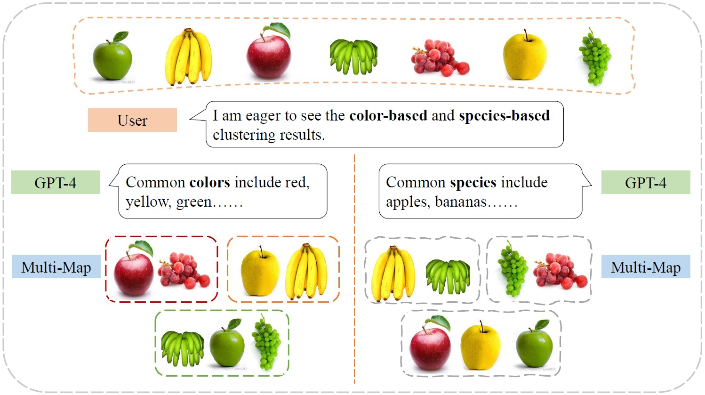

<div align='center'>

# Multi-Modal Proxy Learning Towards Personalized Visual Multiple Clustering

CVPR 2024

[Jiawei Yao](https://alexander-yao.github.io/), [Qi Qian](https://scholar.google.com/citations?user=Rp_40_gAAAAJ&hl=en&oi=ao), [Juhua Hu](http://faculty.washington.edu/juhuah/)*
</div>


|  | 
|:--:| 
| ***The flow chart of Multi-MaP**: Multi-MaP obtains multiple clustering results based on the high-level concepts from users and the reference words from GPT-4.* |


## Requirements
 - We recommend Linux for performance and compatibility reasons.
 - 1 NVIDIA GPUs. We developed and trained the model using RTX 2080 Ti (11GB).
 - PyTorch >= 1.11


## Getting started
### Datasets
- [x] Furit 
- [x] Furit360
- [x] Cards

Please refer to http://faculty.washington.edu/juhuah/images/AugDMC_datasets.zip


### Training and evaluation
Fruit dataset
```
python main.py --dataset fruit --lr 0.005 --alpha 0.3 --beta 0.4 --weight_decay 0.00005
```

Fruit360 dataset
```
python main.py --dataset fruit360 --lr 0.01 --alpha 0.1 --beta 0.3 --weight_decay 0.0
```

Cards dataset
```
python main.py --dataset cards --lr 0.005 --alpha 0.2 --beta 0.3 --weight_decay 0.00001
```
## Bibtex
Please cite our paper if you use this code in your own work:
```
@article{yao2024multi,
  title={Multi-Modal Proxy Learning Towards Personalized Visual Multiple Clustering},
  author={Yao, Jiawei and Qian, Qi and Hu, Juhua},
  journal={arXiv preprint arXiv:2404.15655},
  year={2024}
}
```
## Acknowledgement
This research is supported in part by Advata Gift funding. All opinions, findings, conclusions and recommendations in this paper are those of the author and do not necessarily reflect the views of the funding agencies.
